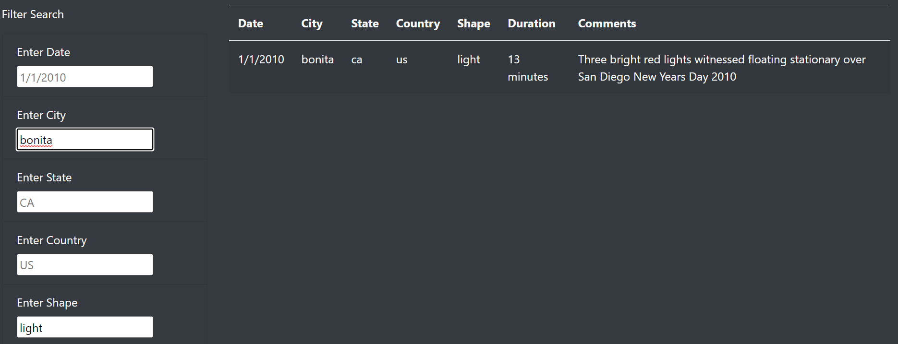

# UFOs
UFO Sightings with JavaScript

### Overview 

The purpose of this project is to build a table with data about UFO sightings that is stored in a JavaScript array. The table data has been placed into an HTML file for easy viewing.Also, the webpage has been customized using Bootstrap,CSS and several fully functional filters have been added that will allow users to interact with the visualizations.

### Results

- The data in the table can be filtered on the basis of Date, City, State, Country and Shape. 
- The users can use a single filter or multiple filters to see the updated results. 
- The user inputs must be in lower case.
- There should not be any spaces at the end of the text.
- Users need to press enter on keyboard after typinf the filter criteria.

##### Single Filter Example

##### Multiple Filter Example

### Summary

##### Drawback

One major drawback of this design is that the user needs to consciously input everything in the filter buttons in lower case. For example, if they type "US" instead of "us", or "CA" instead of "ca" or "El Cajon" instead of "el cajon", the filtered data will not show up.

